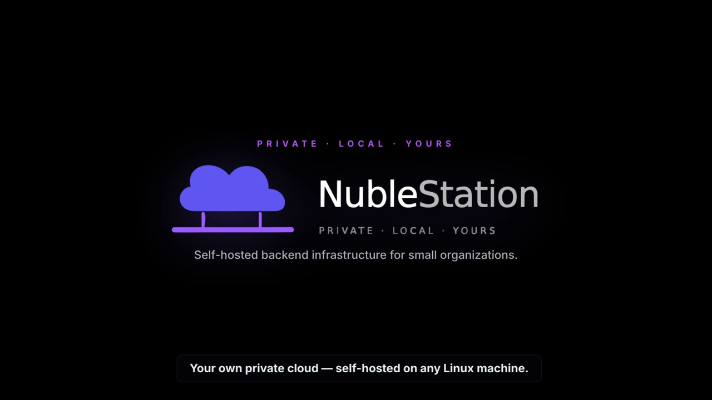

<div align="center">
  
  <h1>NubleStation</h1>
  <p><strong>Self-hosted backend infrastructure for small organizations.</strong><br/>
  One command turns any Linux machine into a private cloud — no internet dependency, no cloud bills.</p>

  <p>
    <a href="https://www.npmjs.com/package/@nublestation/cli">
      
    </a>
    <a href="https://github.com/NabilMouzouna/NubleStation/pkgs/container/nublestation-console">
      
    </a>
    <a href="https://github.com/NabilMouzouna/NubleStation/releases/latest">
      
    </a>
    <a href="https://nabilmouzouna.github.io/NubleStation">
      
    </a>
  </p>
</div>
<div>
  <p>This Project is my Graduation project as a Network and Telecommunications Engineer, which was passed <strong>Successfully</strong></p>
  <ul>
    <li><a href="https://www.youtube.com/watch?v=3_BBOhN8AHE">Introducting NubleStation</a></li>
    <li><a href="https://canva.link/6ge0832qdm04rvj">Nublestation - Graduation presentation</a></li>
  </ul>
</div>
---

## Watch the intro

<div align="center">

<a href="https://github.com/NabilMouzouna/NubleStation/blob/main/packages/assets/introducing%20Nublestation.mp4">
  
</a>

<p><strong>▶ Click to watch the intro</strong> · 0:48</p>

</div>

---

## Services

<table>
  <tr>
    <td align="center" width="20%">
      <br/>
      <b>Orbit</b><br/>
      <sub>Frontend deploy</sub>
    </td>
    <td align="center" width="20%">
      <br/>
      <b>Blaze</b><br/>
      <sub>Database</sub>
    </td>
    <td align="center" width="20%">
      <br/>
      <b>Identity</b><br/>
      <sub>Auth &amp; SSO</sub>
    </td>
    <td align="center" width="20%">
      <br/>
      <b>Vault</b><br/>
      <sub>File storage</sub>
    </td>
    <td align="center" width="20%">
      <br/>
      <b>Gateway</b><br/>
      <sub>API routing</sub>
    </td>
  </tr>
</table>

---

## Get started

### Requirements

| | |
|---|---|
| **OS** | Linux — Ubuntu 22.04+ recommended |
| **Ports** | `80`, `443`, `53` free on the host |
| **Access** | `sudo` |

### Install

```bash
curl -sSL https://github.com/NabilMouzouna/NubleStation/releases/latest/download/install.sh | bash
```

The installer asks four questions — org name, description, admin email, admin password — then starts every service and prints your console URL.

```
╔══════════════════════════════════════════╗
║       NubleStation is ready!             ║
╚══════════════════════════════════════════╝

  Console  →  http://console.clinic.local
  API      →  http://api.clinic.local
  Admin    →  admin@clinic.com

  Router DNS → point to 192.168.1.100
```

### Network setup

Every device on the LAN must use the host as its DNS server. Set the primary DNS in your router to the host IP — all `*.clinic.local` subdomains resolve automatically. For a single machine, `/etc/hosts` is updated by the installer.

### Deploy your first app

```bash
# 1. Install the CLI
npm install -g @nublestation/cli

# 2. Create an app in the Console, copy its API key, then:
nuble init --url http://api.clinic.local --slug my-app --key nbl_<keyId>.<secret>

# 3. Build and deploy
npm run build
nuble deploy
# → live at http://my-app.clinic.local
```

---

## Build with the SDK

Install one package and reach every service through a single client — `@nublestation/client`
pulls in vault, identity, and blaze for you, so there's nothing else to add:

```bash
npm install @nublestation/client
```

```ts
import { nubleClient } from "@nublestation/client";
import { schema } from "./schema";

const { vault, identity, blaze } = nubleClient(
  "nbl_<keyId>.<secret>",
  "http://api.clinic.local",
  { app: "my-app", schema },
);

await vault.upload("reports", "q1.pdf", file);   // file storage
const me = await identity.getSession();           // who is signed in
await blaze.tasks.create({ title: "Review" });    // typed database
```

Define your database as code and push it — Blaze generates the migration, injects
`app_id`, and enables row-level isolation automatically:

```ts
// schema.ts
import { defineSchema, t } from "@nublestation/client";

export const schema = defineSchema({
  tasks: t.model({
    title:  t.string().required(),
    status: t.enum(["todo", "done"]).default("todo"),
  }),
});
```

```bash
nuble db push --schema schema.ts
```

Prefer one service? `@nublestation/vault`, `@nublestation/identity`, and
`@nublestation/blaze` can each be installed standalone *instead of* the client when you
only need one. Full reference → **[docs](https://nabilmouzouna.github.io/NubleStation)**.

---

## Re-running the installer

```
[1] Upgrade to <version>
[2] Reset super admin password
[3] Reinstall
[4] Exit
```

Existing secrets are reused on upgrade — your data is safe.

---

## How it works

```
Install                          Deploy
─────────────────────            ──────────────────────────────────────
curl install.sh | bash           nuble deploy
 → Docker + CoreDNS + Caddy       → zips dist/
 → PostgreSQL (platform schema)   → POST /v1/orbit/deploy (HMAC-signed)
 → Console seeds org + admin      → Gateway → Orbit extracts bundle
 → *.clinic.local resolves        → Caddy serves my-app.clinic.local
```

---

## Repository structure

```
apps/                          one process per container
  gateway/     API entry point — the only LAN-exposed service
  console/     Next.js admin dashboard
  orbit/       Frontend deploy service
  blaze/       Database service — auto-REST, RLS, migrations
  identity/    Auth service — sessions, API keys, SSO
  vault/       File storage service
  docs/        Documentation site (Astro)
packages/                      published to npm
  client/      @nublestation/client — unified SDK (vault + identity + blaze)
  vault/       @nublestation/vault — storage SDK
  identity/    @nublestation/identity — auth SDK
  blaze/       @nublestation/blaze — schema DSL + database client
  cli/         @nublestation/cli — nuble init · db push · deploy · server
  ui/ shared/  Internal shared code
infra/
  docker-compose.yml
  caddy/Caddyfile
  coredns/Corefile.template
scripts/
  install.sh · dns-doctor.sh
docs/          Architecture decision records + documentation site
```

## Development

```bash
git clone https://github.com/NabilMouzouna/NubleStation
cd NubleStation
pnpm install
pnpm dev
```

Full documentation → **[nabilmouzouna.github.io/NubleStation](https://nabilmouzouna.github.io/NubleStation)**
