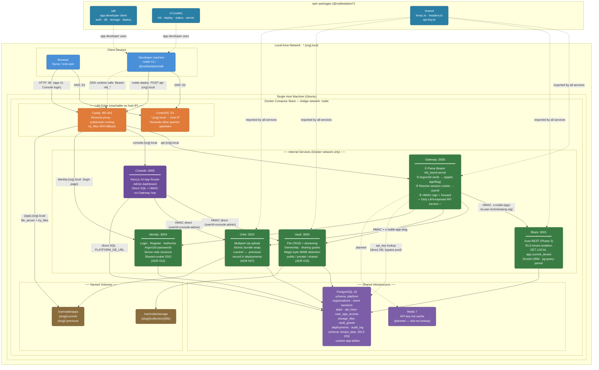
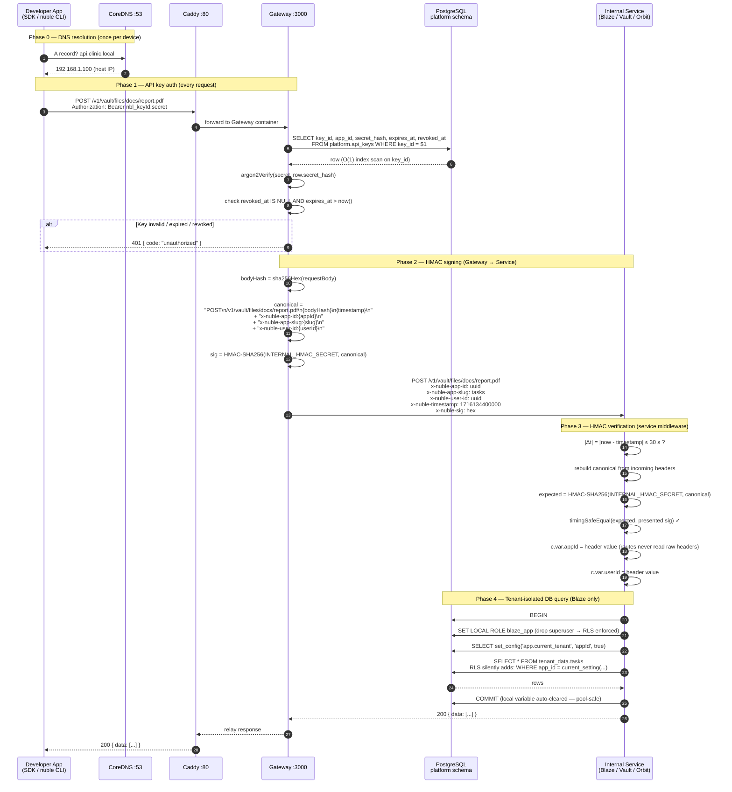
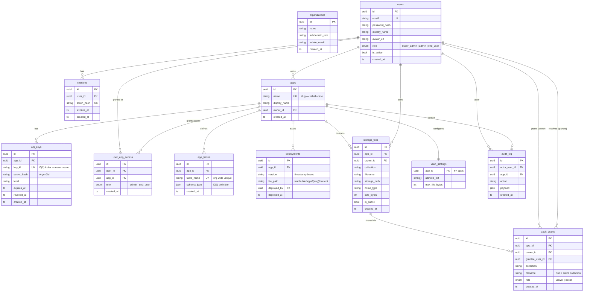

Four diagrams covering every layer of the system. Paste any block into [Eraser.io](https://eraser.io) (select the **Mermaid** renderer) or any Mermaid-compatible viewer.

---

## Diagram 1 — Full System Architecture

The complete topology: LAN clients, DNS, reverse proxy, all services, data layer, volumes, and the npm packages that developers use.



---

## Diagram 2 — End-to-End Request Lifecycle

A single SDK or CLI call, traced from DNS resolution through Gateway auth, HMAC signing, and the tenant-isolated database transaction.



---

## Diagram 3 — Auth Flows

Three distinct authentication paths: end-user session login (SSO), developer API key, and Console admin direct access.

```mermaid
sequenceDiagram
    autonumber
    participant App   as Browser / App
    participant Cad   as Caddy
    participant GW    as Gateway
    participant ID    as Identity :3004
    participant Redis as Redis (planned)
    participant DB    as PostgreSQL
    participant CS    as Console

    rect rgb(30, 60, 90)
        Note over App,DB: Path A — End-user session login (SSO)
        App  ->> Cad:  GET identity.{org}.local/login
        Cad  ->> ID:   forward
        ID   -->> App: HTML login form

        App  ->> ID:   POST /login  { email, password }
        ID   ->> DB:   SELECT * FROM platform.users WHERE email = $1
        DB   -->> ID:  user row  (password_hash argon2id)
        ID   ->> ID:   argon2Verify(password, hash)  ✓
        ID   ->> DB:   INSERT INTO platform.sessions (id, user_id, token_hash, expires_at)
        ID   -->> App: Set-Cookie: nuble_session=token<br/>Domain=.{org}.local; HttpOnly; SameSite=Lax
        Note over App: Cookie auto-sent to ALL *.{org}.local subdomains (SSO)

        App  ->> Cad:  GET tasks.{org}.local  (subsequent request)
        Cad  ->> GW:   forward  Cookie: nuble_session=token
        GW   ->> DB:   SELECT user_id FROM platform.sessions<br/>WHERE token_hash = sha256(token) AND expires_at > now()
        DB   -->> GW:  { userId }
        GW   ->> GW:   proceed to HMAC-sign and forward
    end

    rect rgb(20, 70, 40)
        Note over App,DB: Path B — API key auth (SDK / CLI)
        App  ->> GW:   any request<br/>Authorization: Bearer nbl_keyId.secret
        GW   ->> Redis: GET key:keyId  (planned hot-path)
        Redis -->> GW:  MISS
        GW   ->> DB:   SELECT id, app_id, secret_hash, expires_at, revoked_at<br/>FROM platform.api_keys JOIN platform.apps WHERE key_id = $1
        DB   -->> GW:  row
        GW   ->> GW:   argon2Verify(secret, row.secret_hash)  ✓
        GW   ->> Redis: SET key:keyId {appId,appSlug}  EX 300  (planned)
        GW   ->> GW:   proceed to HMAC-sign and forward
    end

    rect rgb(70, 35, 15)
        Note over CS,DB: Path C — Console admin (direct HMAC, no Gateway hop)
        CS   ->> DB:   SELECT * FROM platform.storage_files  (direct SQL)
        CS   ->> VT:   POST /v1/vault/grants<br/>x-nuble-app-id: uuid<br/>x-nuble-user-id: console-admin<br/>x-nuble-sig: HMAC(INTERNAL_HMAC_SECRET, canonical)
        Note over CS: Console signs with the same INTERNAL_HMAC_SECRET.<br/>Services cannot distinguish Console from Gateway requests.
    end
```

---

## Diagram 4 — Platform Database Schema

All tables in the `platform` schema and their relationships. The `tenant_data` schema holds developer-defined tables (with RLS ON) and is not shown here — every table in it gets an `app_id` column and an auto-generated RLS policy.



---

## HMAC canonical request format

All four services (Blaze, Vault, Orbit, Identity) use the same signing contract defined in `packages/shared/src/hmac.ts`.

```
METHOD\n
PATH\n
BODY_SHA256_HEX\n
TIMESTAMP_MS\n
x-nuble-app-id:uuid\n
x-nuble-app-slug:slug\n       ← Orbit and Vault only
x-nuble-user-id:uuid\n
```

Context headers are sorted **lexicographically** before signing. Timestamp skew tolerance is **±30 seconds** (`HMAC_MAX_SKEW_MS = 30_000`).

## Eraser.io native DSL (flowchart)

If you prefer Eraser's own diagram language over Mermaid import, paste the block below into a new **Flowchart** diagram on Eraser.io:

```
direction right
title NubleStation — System Architecture

// LAN edge
CoreDNS [icon: dns, color: orange, label: "CoreDNS :53\n*.{org}.local → host IP"]
Caddy [icon: server, color: orange, label: "Caddy :80/443\nReverse proxy"]

// Internal services
Gateway [icon: api-gateway, color: green, label: "Gateway :3000\nKey auth · HMAC sign · Route"]
Identity [icon: shield, color: blue, label: "Identity :3004\nSSO · Sessions · Login"]
Blaze [icon: database, color: green, label: "Blaze :3001\nPostgres + RLS tenant isolation"]
Vault [icon: folder, color: green, label: "Vault :3003\nFile storage · Ownership · Sharing"]
Orbit [icon: rocket, color: green, label: "Orbit :3002\nAtomic bundle deploy"]
Console [icon: monitor, color: purple, label: "Console :3000\nNext.js admin dashboard"]

// Data
PostgreSQL [icon: postgresql, color: purple, label: "PostgreSQL 16\nplatform + tenant_data schemas"]
Redis [icon: redis, color: red, label: "Redis (planned)\nAPI-key hot cache"]

// Volumes
AppVol [icon: hard-drive, label: "/var/nuble/apps\n{slug}/current/"]
StgVol [icon: hard-drive, label: "/var/nuble/storage\n{slug}/{collection}/{file}"]

// Clients
Browser [icon: globe, label: "Browser\nNurse / end-user"]
Developer [icon: user, label: "Developer\nCLI + SDK"]

// DNS + HTTP
Browser -> CoreDNS: DNS :53
Browser -> Caddy: HTTP :80
Developer -> CoreDNS: DNS :53
Developer -> Caddy: nuble deploy

// Caddy routing
Caddy -> Gateway: api.{org}.local
Caddy -> Console: console.{org}.local
Caddy -> Identity: identity.{org}.local
Caddy -> AppVol: {app}.{org}.local (static SPA)

// Gateway → internal (HMAC signed)
Gateway -> Blaze: HMAC x-nuble-*
Gateway -> Vault: HMAC + x-nuble-app-slug
Gateway -> Orbit: HMAC + x-nuble-app-slug
Gateway -> Identity: cookie forward (no HMAC)

// Console admin (direct, no Gateway)
Console -> Vault: direct HMAC (userId=console-admin)
Console -> Orbit: direct HMAC (userId=console-admin)
Console -> PostgreSQL: direct SQL (PLATFORM_DB_URL)

// Services → data
Blaze -> PostgreSQL
Vault -> PostgreSQL
Identity -> PostgreSQL
Orbit -> PostgreSQL
Gateway ..> Redis: planned hot-path

// Services → volumes
Vault -> StgVol
Orbit -> AppVol
```
