# ADR 002 — Console design system: Meta-inspired tokens + sitemap

**Status:** Accepted
**Date:** 2026-05-10
**Updated:** 2026-05-21

## Context

The Console (Next.js admin dashboard at `console.{org}.local`) is the only surface end users — clinic admins, IT, developers deploying apps — see directly. It needs a coherent design system before component work begins. Building one from scratch costs weeks; importing a full off-the-shelf kit (shadcn/ui, Mantine) gives speed but no brand identity that matches the "private cloud appliance" positioning.

## Decision

Adopt a **Meta-inspired token system** as Console's foundation: pill buttons (`rounded.full` 100px), a stark white canvas, a single saturated cobalt accent (`#0064E0`) for primary action, an Optimistic VF–style display face with `ss01`/`ss02` stylistic sets, a 4px spacing base, and `rounded.xxxl` (32px) card geometry as the dominant signature.

## Rationale

| Concern | From scratch | Stock UI kit | Meta-inspired tokens |
|---|---|---|---|
| **Time to first component** | Weeks | Hours | ~1 day to wire tokens |
| **Brand identity** | Whatever ships | Generic | Confident hardware-merchandiser voice — fits "Synology NAS for developers" |
| **Token discipline** | Risk of drift | Imposed by library | Imposed by this ADR |
| **Surface fit for admin** | TBD | Neutral | Good once commerce surfaces are stripped |

NubleStation is positioned as a hardware appliance for clinics. Meta's hardware-commerce voice — dark-pill CTA on stark white, single cobalt accent, photography-light cards — translates cleanly to an infrastructure console. The pill + `rounded.xxxl` card pairing is the recognizable signature carried across.

## Adaptations

The reference spec was a commerce design language. Console is admin software, so:

- **Primary CTA is the cobalt pill.** The dual-CTA pattern (black marketing pill + cobalt buy pill) collapses to one — Console has no marketing surface, every action is a "do it" affordance.
- **Drop:** promo strips, checkout summary cards, SKU pickers, product galleries, warranty cards, testimonial cards, promo banners, sale badges. None map to admin tasks.
- **Keep:** the button family, icon-feature cards, feature cards, text inputs, radio options, semantic badges (success/critical/attention/warning), accordion items, spec tables (reused as resource detail layouts), and the footer region.
- **Typography:** Optimistic VF is proprietary. Use Inter (or another open variable face that exposes equivalent stylistic sets) with the same `ss01`/`ss02` switching pattern; preserve the negative letter-spacing on body roles.
- **Dark mode:** flagged as a gap in the source spec. Deferred until 1.0 — clinic environments are bright and admin sessions are short.

## Consequences

- A `packages/design/` workspace exports tokens as CSS custom properties + a typed TS module, consumed by `apps/console`.
- The fallback variable typeface must be picked and committed before component work starts.
- Adopting this voice locks Console into pill buttons everywhere and `rounded.xxxl` cards — squared buttons or sharp cards will read as "third-party widget" against the rest of the surface.
- The reference DESIGN.md spec is removed in the same commit as this ADR; subsequent component work references this ADR and the `packages/design/` source as authoritative.

## References

- ADR 001 — separates Console as its own deployable surface, which is what justifies giving it a dedicated design identity.

---

## Sitemap

### Route inventory

| Route | Access | Description |
|---|---|---|
| `/` | Any (redirects) | Landing — redirects to `/dashboard` if authenticated, else `/auth` |
| `/auth` | Public | Login gate — email + password against `admin.db` |
| `/dashboard` | Auth required | Infra health overview: service status, uptime, recent events |
| `/watch` | Auth required | Live log tail — Docker logs + HMAC-signed service events |
| `/apps` | Auth required | App registry — list all apps, per-app usage, create new app |
| `/apps/:app` | Auth required | App detail — deployments, env vars, API keys, DB, storage, migrations, users |
| `/admins` | super_admin only | Manage platform admins — invite, revoke, role assignment |
| `/audit` | Auth required | Platform audit log — every mutating admin action from `platform_audit` |
| `/settings` | super_admin only | Org info, host network config, HMAC secret rotation |
| `/network` | Auth required | Topology view — DNS zones, Caddy upstreams, registered subdomains |
| `/storage` | Auth required | Org-wide disk usage — total used, per-app breakdown, largest files |

### Navigation flow

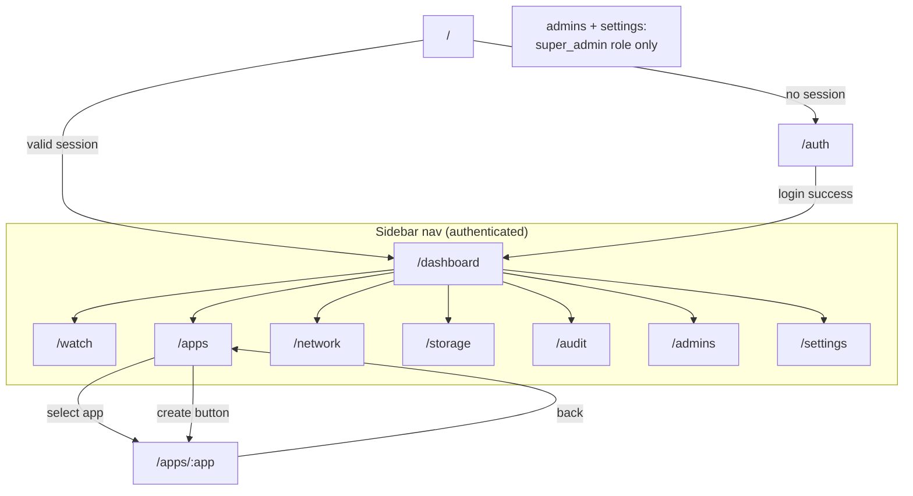

### Layout structure

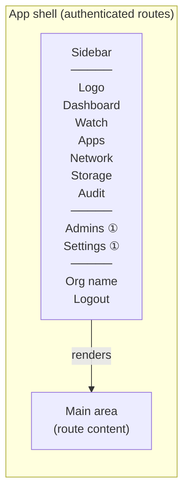

① Admins and Settings are sidebar items visible only to `super_admin` role. `admin` role users see the same shell but those items are hidden and the routes return 403.

Auth (`/auth`) renders without the shell — full-page centered card.

---

## Pages

### `/` — Root redirect

No UI. Server component reads session cookie:
- Valid session → `redirect('/dashboard')`
- No session → `redirect('/auth')`

---

### `/auth` — Login

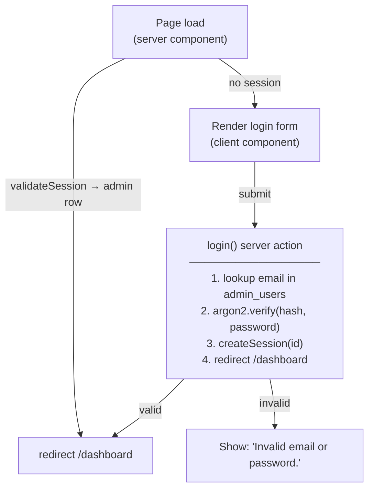

**UI elements:** NubleStation wordmark at top, email input, password input, "Sign in" pill button, error message area (hidden until first failed attempt), no registration or "forgot password" link (admin identity is seeded at install).

---

### `/dashboard` — Infra health

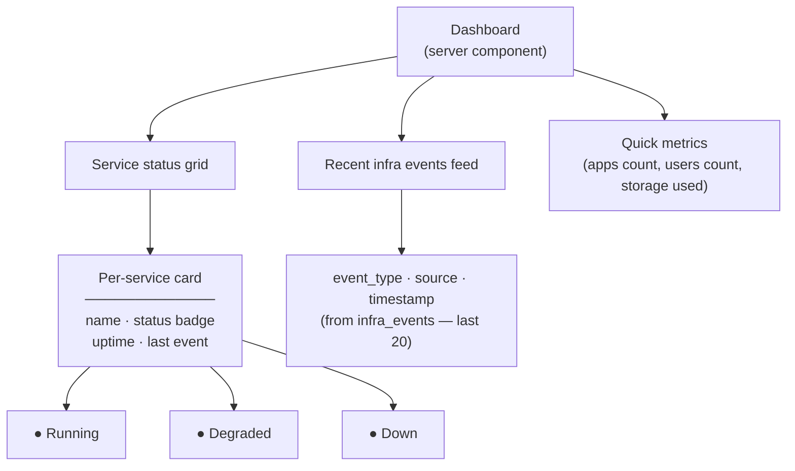

**Data sources:**
- Service status: Docker socket polling (via `GET /healthz` on each service's internal port)
- Infra events: `SELECT * FROM infra_events ORDER BY created_at DESC LIMIT 20` on `admin.db`
- Quick metrics: aggregated queries against `platform.*` tables via the db service's `/v1/admin/*` routes

Services shown: gateway, db, auth, storage, deploy, postgres, caddy, coredns.

---

### `/watch` — Live logs

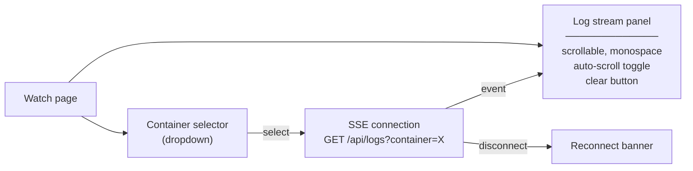

**Data source:** The console Next.js API route (`/api/logs`) connects to the Docker socket (bind-mounted into console container at `/var/run/docker.sock`) and streams `docker logs --follow --tail 100 <container>` output as SSE.

Events from services (HMAC-signed POSTs to `/internal/events`) are written to `infra_events` and surfaced here as a second tab or mixed into the stream with a `[service]` prefix badge.

**No persistence beyond `infra_events` table** — log tail is ephemeral, refreshing the page restarts from `--tail 100`.

---

### `/apps` — App registry

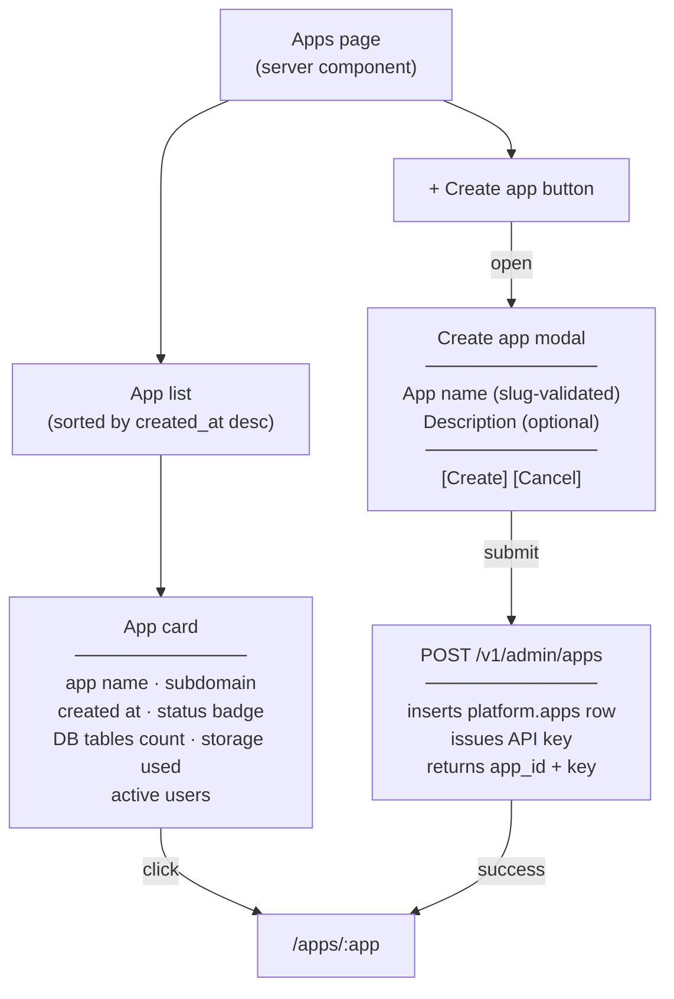

**Per-app card data** is fetched via the db service `/v1/admin/apps` route which aggregates: table count from `platform.app_tables`, storage used from `platform.apps`, user count from `platform.user_app_access`.

---

### `/apps/:app` — App detail

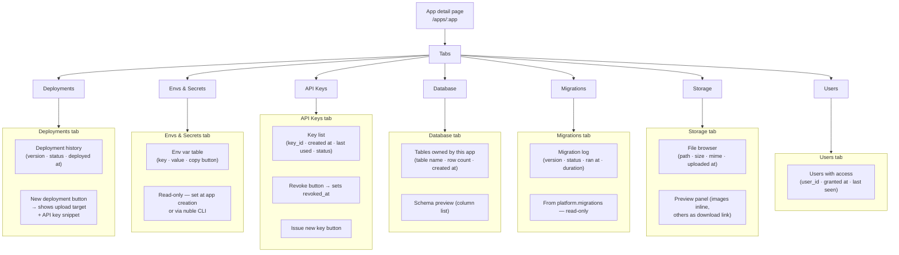

**Deployments tab** shows the platform-managed static file upload flow: developer runs `nuble deploy` → CLI POSTs the `dist/` zip → deploy service unpacks to `/var/nuble/apps/:app/` → Caddy serves it at `{appname}.{org}.local`. Console shows the status of each deployment and the endpoint URL.

**Envs & Secrets tab** surfaces the values the app developer needs to configure their SDK: the `api.{org}.local` base URL. Future: per-app environment variable store.

**API Keys tab** lists entries from `platform.api_keys WHERE app_id = :app`. Shows `key_id` and creation date — never `secret_hash`. Revoke sets `revoked_at`; issue new key returns the full `nbl_<key_id>.<secret>` string once, then it's gone. Key rotation without SSH access.

**Database tab** lists tables the app owns (from `platform.app_tables`) with row counts. No SQL editor in Phase 1 — read-only schema view only.

**Migrations tab** shows the migration history from `platform.migrations` for this app — version, status, ran at, duration. Read-only. Lets the developer debug a failed migration without SSH access.

**Storage tab** reads `/var/nuble/apps/:app/files/` directory listing (served via the storage service's `/v1/admin/storage/:app` route). Images render inline in a preview panel.

**Users tab** lists entries in `platform.user_app_access` — users who have been granted access to this app's resources.

---

### `/admins` — Admin user management

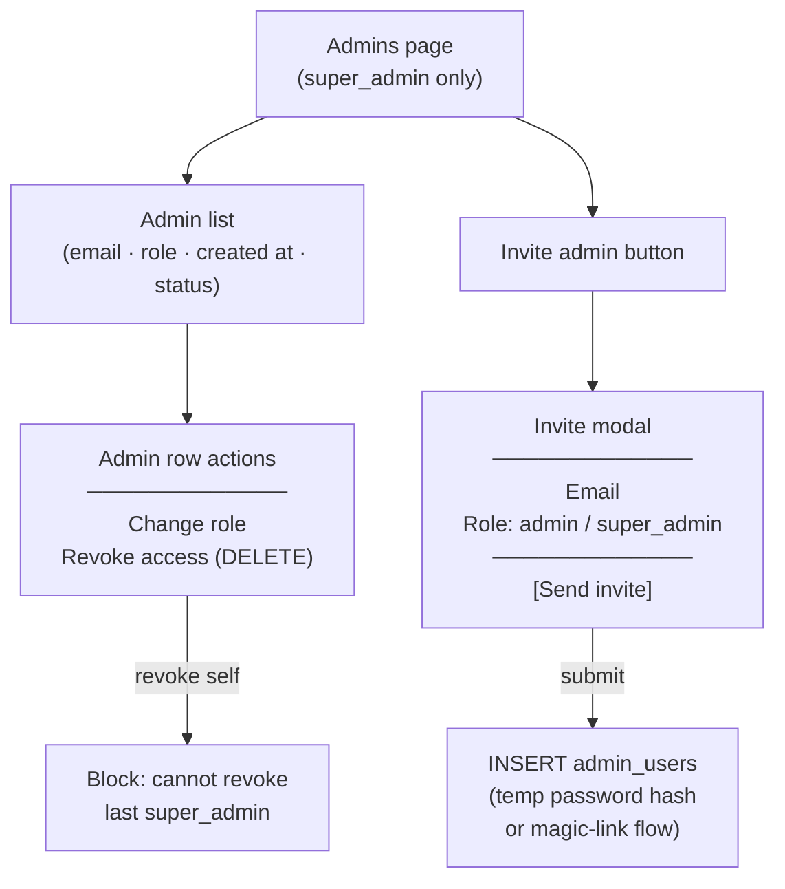

**Access:** `super_admin` only — `admin` role gets 403. Reads/writes `admin_users` in `admin.db`. Revoking the last `super_admin` is blocked server-side. Initial admin is always the one seeded by `install.sh` and cannot be deleted.

---

### `/audit` — Platform audit log

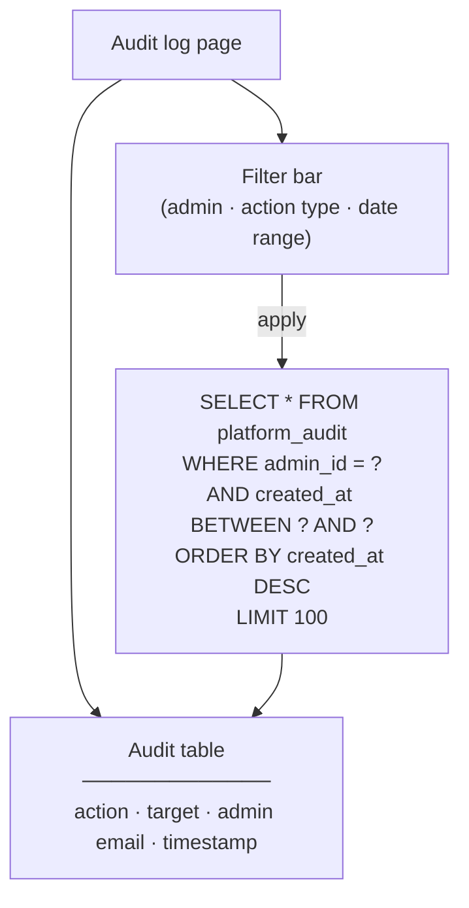

**Data source:** `platform_audit` in `admin.db` — append-only, written by the console on every mutating action (app created, admin invited, key revoked, deployment triggered, etc.). No delete or edit of audit rows — ever. Exportable as CSV for compliance handoff.

---

### `/settings` — Org + platform config

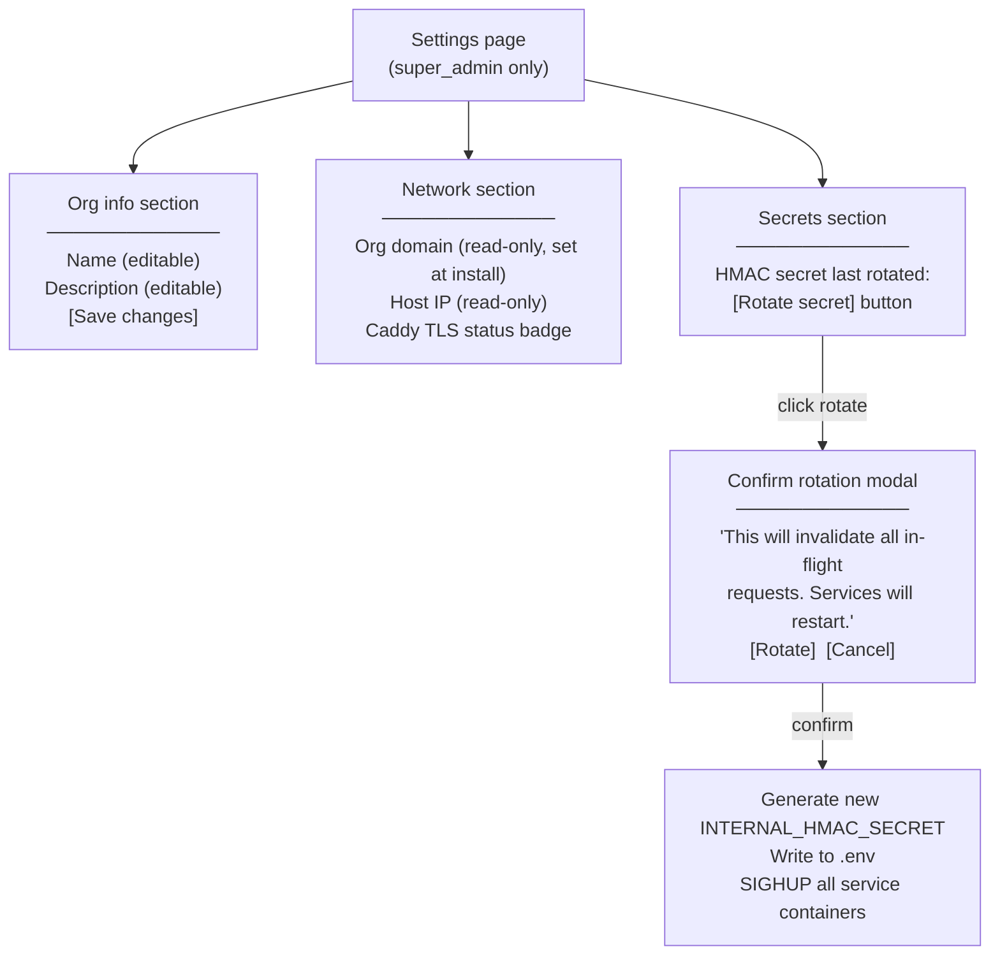

**Access:** `super_admin` only. Org name/description writes to `organization` in `admin.db`. HMAC secret rotation rewrites the shared secret and sends SIGHUP to all service containers — brief (~2s) interruption. Network fields are read-only post-install (changing domain requires reinstall).

---

### `/network` — Topology view

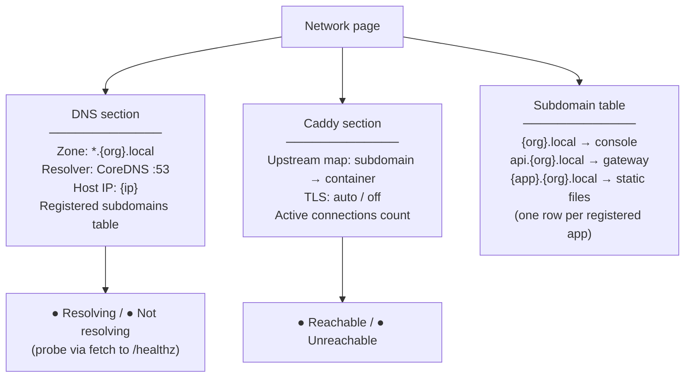

**Data source:** subdomain table is built from `platform.apps` (one row per app) + hardcoded system subdomains (console, api). DNS and Caddy badges are live probes — not polled, fetched on page load. No editing — topology is determined by `install.sh` and app creation.

---

### `/storage` — Org-wide disk usage

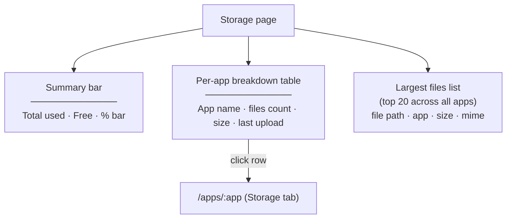

**Data source:** storage service's `/v1/admin/storage` route which walks `/var/nuble/apps/` on the host filesystem. Summary bar uses `df` output for actual disk free vs. used. Clicking a row navigates to the app's storage tab for file-level browsing.
