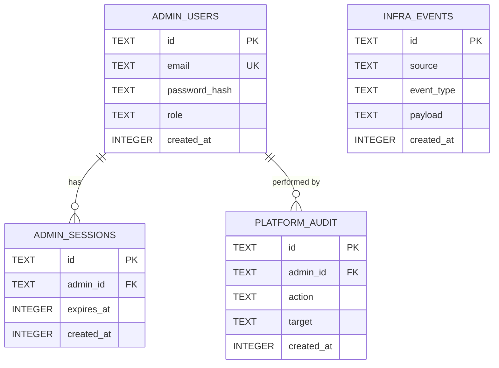

# Console SQLite Schema — Entity Relationship Diagram

The console service uses a dedicated SQLite file (`/var/nuble/admin.db`) for platform admin identity and observability data. It is completely independent from PostgreSQL — the console can authenticate admins and show infra state even when the service layer is fully down.

See ADR 005 §2 for the full rationale behind using SQLite over PostgreSQL for this layer.

## Table Notes

### `admin_users`
Platform administrators only — not clinic staff or app tenants. Two roles:
- `super_admin` — seeded by `install.sh`, full access, cannot be deleted
- `admin` — invited by super admin, access scoped per invite

`password_hash` is Argon2id. The plaintext password never enters `.env` and never touches any container — it is hashed by `install.sh` before Docker starts.

### `admin_sessions`
Managed by Lucia v3. `expires_at` is a Unix timestamp (integer, not ISO string — SQLite has no native datetime type). Sessions are validated on every request via middleware before any dashboard route is served.

### `infra_events`
Append-only. Written by `POST /internal/events` — an endpoint that accepts HMAC-signed pushes from services (gateway, db, auth, storage). Services fire-and-forget; no retry on failure. `payload` is a JSON string. `source` is the service name, `event_type` follows dot-notation (e.g. `migration.ran`, `key.issued`, `deploy.triggered`).

`INFRA_EVENTS` has no FK to `ADMIN_USERS` — events come from services, not admins.

### `platform_audit`
Written by the console on every mutating admin action (app created, admin invited, key revoked, etc.). `target` holds the affected resource ID as a plain string. Append-only — no UPDATE or DELETE.

## Design Constraints

| Constraint | How enforced |
|---|---|
| One file, no server | SQLite — `better-sqlite3`, synchronous reads in Next.js server components |
| Exists before Docker | Created by `install.sh` before `docker compose up` |
| Independent of Postgres | No foreign keys or queries cross into PostgreSQL |
| Schema evolution | Console runs its own migration runner on boot (same pattern as ADR 003 §11) |
| Mount strategy | Bind mount: `/var/nuble/admin.db → /app/admin.db:rw` in docker-compose.yml |
