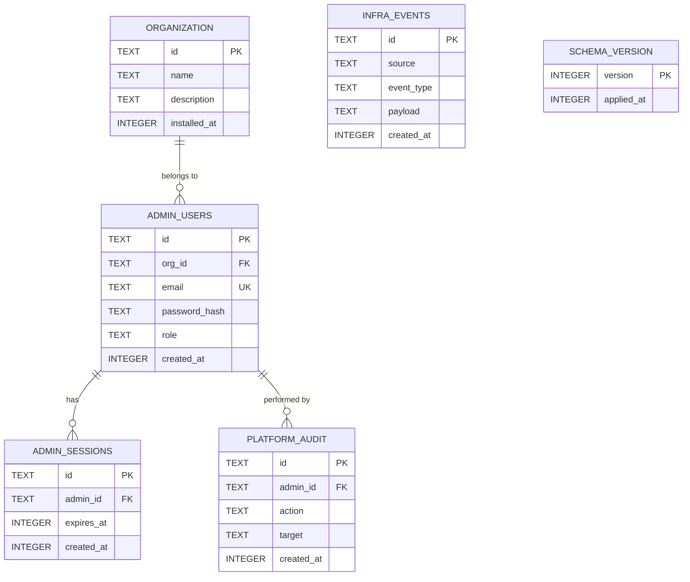

# Console SQLite Schema — Entity Relationship Diagram

The console service uses a dedicated SQLite file (`/var/nuble/admin.db`) for platform admin identity and observability data. It is completely independent from PostgreSQL — the console can authenticate admins and show infra state even when the service layer is fully down.

See ADR 005 §2 for the full rationale behind using SQLite over PostgreSQL for this layer.

## Where the file lives and how the console reads it

```
Host filesystem: /var/nuble/admin.db        ← created by install.sh before Docker starts
                        │
                        │ bind mount (docker-compose.yml)
                        ▼
Console container: /app/admin.db            ← read/written by Next.js server-side code
```

The console never creates the file. `install.sh` creates and seeds it on the host using the `sqlite3` CLI and `scripts/seed-admin.sql`. When the console container starts, it finds an already-populated file at `/app/admin.db`.

Next.js server components and server actions open it with `better-sqlite3` (synchronous — no async overhead, no network):

```ts
import Database from "better-sqlite3";
const db = new Database("/app/admin.db");
```

Client components never access `admin.db` directly — only server-side code does.

## Schema creation — who owns it

The schema is created by `install.sh` running `scripts/seed-admin.sql` via the `sqlite3` CLI on the host — **before any container starts**. The console does not run Drizzle migrations. On boot, it performs a lightweight version check (a `schema_version` row) and applies any pending upgrade migrations if NubleStation itself was updated. The primary source of truth for the schema is `scripts/seed-admin.sql`.

```
install.sh
  ├── sqlite3 /var/nuble/admin.db < scripts/seed-admin.sql
  │     ├── CREATE TABLE organization
  │     ├── CREATE TABLE admin_users
  │     ├── CREATE TABLE admin_sessions
  │     ├── CREATE TABLE infra_events
  │     ├── CREATE TABLE platform_audit
  │     ├── CREATE TABLE schema_version
  │     ├── INSERT INTO organization (name, description, installed_at)
  │     └── INSERT INTO admin_users  (org_id, email, password_hash, role, ...)
  └── docker compose up

Console container boot
  ├── opens /app/admin.db with better-sqlite3
  └── checks schema_version → applies upgrade migrations if needed
```



## Table Notes

### `organization`
A single row, seeded by `install.sh` at install time. Holds the org name and an optional description displayed in the console header. `installed_at` is a Unix timestamp. There is always exactly one organization per NubleStation instance — this table never has more than one row.

### `admin_users`
Platform administrators only — not clinic staff or app tenants. `org_id` references `organization(id)` — since there is only one org, this is always the same value, but the FK makes the relationship explicit and enforces referential integrity. Two roles:
- `super_admin` — seeded by `install.sh`, full access, cannot be deleted
- `admin` — invited by super admin, access scoped per invite

`password_hash` is Argon2id. The plaintext password never enters `.env` and never touches any container — it is hashed by `install.sh` before Docker starts.

### `admin_sessions`
Managed by Lucia v3. `expires_at` is a Unix timestamp (integer, not ISO string — SQLite has no native datetime type). Sessions are validated on every request via middleware before any dashboard route is served.

### `infra_events`
Append-only. Written by `POST /internal/events` — an endpoint that accepts HMAC-signed pushes from services (gateway, db, auth, storage). Services fire-and-forget; no retry on failure. `payload` is a JSON string. `source` is the service name, `event_type` follows dot-notation (e.g. `migration.ran`, `key.issued`, `deploy.triggered`).

`INFRA_EVENTS` has no FK to `ADMIN_USERS` — events come from services, not admins.

### `platform_audit`
Written by the console on every mutating admin action (app created, admin invited, key revoked, etc.). `target` holds the affected resource ID as a plain string. Append-only — no UPDATE or DELETE.

### `schema_version`
A single row tracking the current schema version number. Written by `seed-admin.sql` on install. On console boot, `better-sqlite3` reads this row and applies any pending upgrade migrations if the NubleStation version has advanced. No FKs — fully standalone.

## Design Constraints

| Constraint | How enforced |
|---|---|
| One file, no server | SQLite — `better-sqlite3`, synchronous reads in Next.js server components |
| Exists before Docker | Created by `install.sh` before `docker compose up` |
| Independent of Postgres | No foreign keys or queries cross into PostgreSQL |
| Schema evolution | `seed-admin.sql` is source of truth; console checks `schema_version` on boot for upgrades |
| Mount strategy | Bind mount: `/var/nuble/admin.db → /app/admin.db:rw` in docker-compose.yml |
