# From `install.sh` to Console — Under the Hood

This document traces the complete path from a single `curl | bash` command to a working NubleStation console accessible in a browser on the LAN. Every step is explained with the reasoning behind it.

---

## The Big Picture

Before diving into steps, here is the full topology that `install.sh` builds and that every subsequent request flows through.

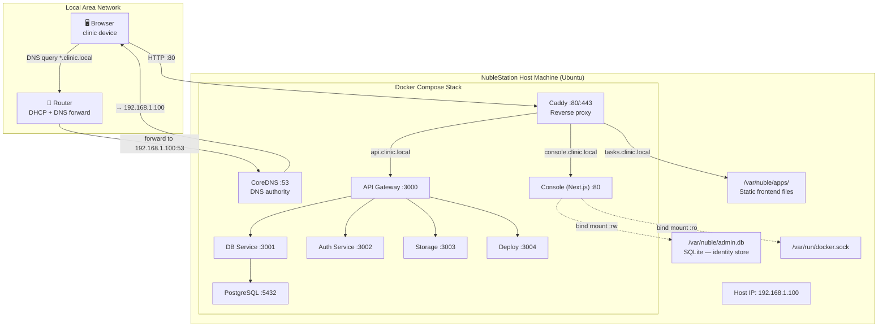

---

## Phase 1 — `install.sh` Executes

Everything starts with one command on the host machine:

```bash
curl -sSL https://get.nublestation.io/install.sh | bash
```

### What the script does, in order

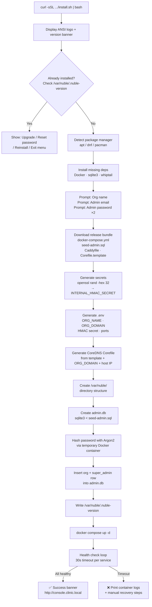

### Checkpoint system

The script writes a checkpoint file at `/var/nuble/.install-checkpoint` after each major step. If it crashes midway, re-running it reads the checkpoint and resumes from where it left off — no starting over from scratch.

```
1. deps-checked      ← Docker, sqlite3, uuidgen verified
2. files-downloaded  ← Bundle pulled from GitHub
3. env-generated     ← .env written
4. db-created        ← admin.db created and seeded
5. compose-started   ← docker compose up -d succeeded
6. health-verified   ← all containers healthy ← file deleted here
```

---

## Phase 2 — SQLite Bootstrap (`admin.db`)

This is the most important step that runs **before any Docker container starts**. The console needs a pre-existing identity store to authenticate admins — it cannot bootstrap itself.

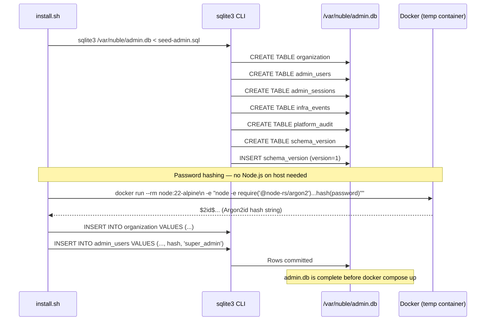

### Why SQLite and not PostgreSQL?

| Question | PostgreSQL | SQLite (`admin.db`) |
|---|---|---|
| Exists before Docker starts? | No — it is a container | Yes — `install.sh` creates it on the host |
| Console works if Postgres is down? | No — auth blocked | Yes — fully independent |
| Super admin locked out during incident? | Possible | Never |
| Backup | Part of `pg_dump` | `cp /var/nuble/admin.db backup/` |

Platform admins are not tenants. They manage the infrastructure. Their identity lives separately from app data — by design.

---

## Phase 3 — Docker Compose Boot Sequence

Once `admin.db` exists, `docker compose up -d` starts all containers. They do not all start at the same time — Docker respects `depends_on` + `healthcheck` ordering.

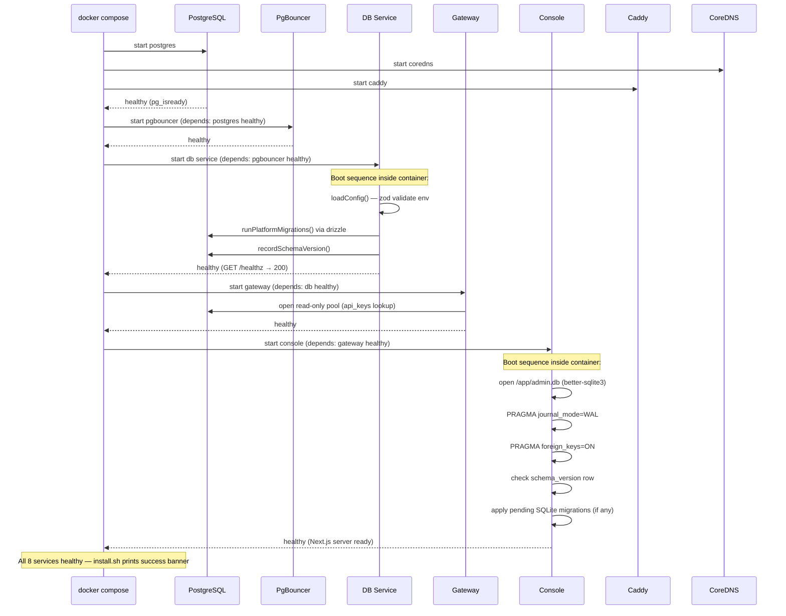

### What the bind mounts look like

```
Host filesystem                    Inside containers
─────────────────                  ─────────────────
/var/nuble/admin.db    ──────────► /app/admin.db          (console, rw)
/var/run/docker.sock   ──────────► /var/run/docker.sock   (console, ro)
/var/nuble/apps/       ──────────► /var/nuble/apps/        (deploy, rw)
                                   /var/nuble/apps/        (caddy, ro — static files)
```

---

## Phase 4 — DNS Resolution on the LAN

For any device on the network to reach `console.clinic.local`, DNS must work. CoreDNS handles this entirely.

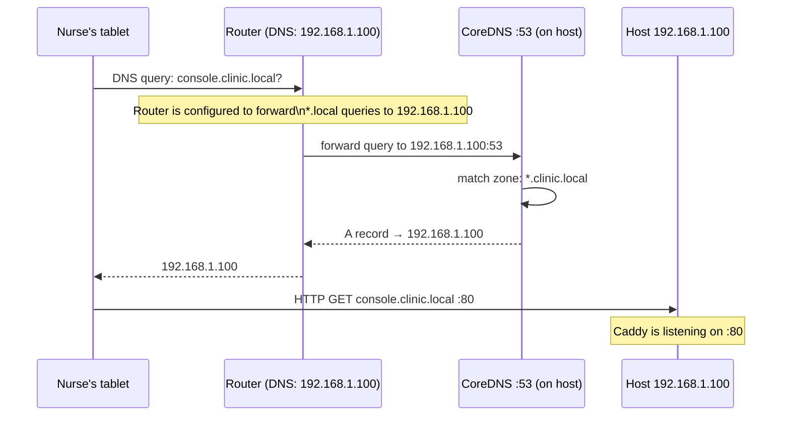

### CoreDNS Corefile (generated by install.sh)

```
clinic.local {
    hosts {
        192.168.1.100 console.clinic.local
        192.168.1.100 api.clinic.local
        192.168.1.100 *.clinic.local
        fallthrough
    }
    forward . 1.1.1.1 8.8.8.8
    log
    errors
}
```

Every subdomain — whether system (`console`, `api`) or app (`tasks`, `patients`) — resolves to the single host IP. Caddy then routes by hostname.

---

## Phase 5 — HTTP Request Flow Through Caddy

After DNS resolves, the HTTP request hits port 80 on the host. Caddy intercepts it.

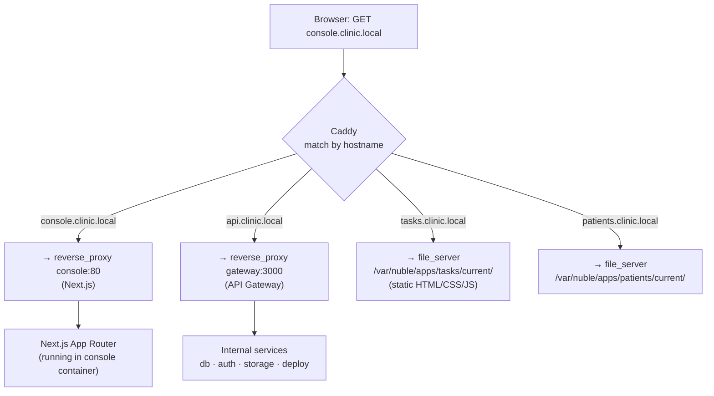

### Caddyfile structure

```
# System routes — proxied to containers
console.clinic.local {
    reverse_proxy console:80
}

api.clinic.local {
    reverse_proxy gateway:3000
}

# App routes — served from filesystem
*.clinic.local {
    @notSystem not host console.clinic.local api.clinic.local
    handle @notSystem {
        root * /var/nuble/apps/{labels.1}/current
        file_server
        try_files {path} /index.html
    }
}
```

The `try_files … /index.html` fallback is what makes React Router and Vue Router work — unknown paths fall back to the SPA entry point instead of 404ing.

---

## Phase 6 — Console Boot (Inside the Container)

When the console container starts, Next.js performs its own initialization before accepting any request.

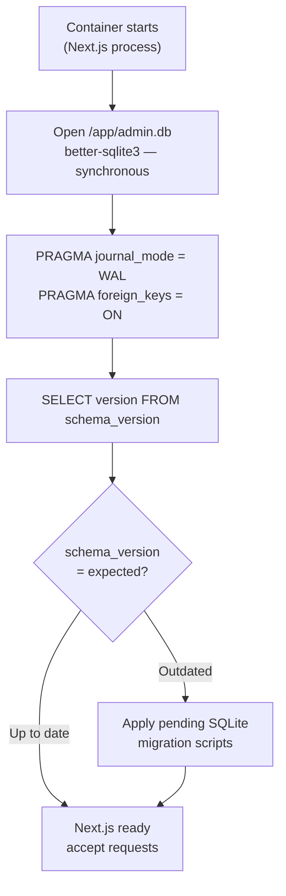

**Why `better-sqlite3` (synchronous)?**
Next.js server components run in a Node.js environment where synchronous SQLite reads are fast (microseconds for a local file) and safe. No async overhead, no connection pool, no network. The database is a file on the same filesystem as the process.

---

## Phase 7 — First Login (Auth Flow)

The super admin opens `console.clinic.local` for the first time. No session cookie exists yet.

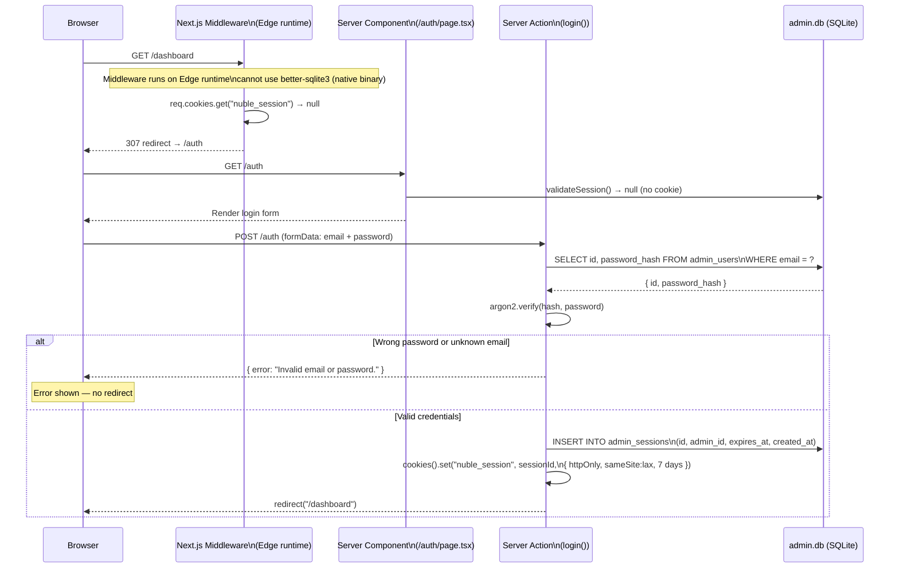

### Security properties of this flow

| Property | How enforced |
|---|---|
| Password never stored plaintext | Argon2id hash stored, plaintext discarded after `install.sh` |
| Timing-safe comparison | `argon2.verify()` is constant-time |
| Username enumeration prevention | Same error for "not found" and "wrong password" |
| Session ID unguessable | `crypto.randomBytes(32).toString("hex")` = 256 bits of entropy |
| Session cookie not accessible to JS | `httpOnly: true` |
| CSRF protection | `sameSite: lax` — cookie not sent on cross-site POSTs |
| Session expires | `expires_at` stored in DB, validated on every request |

---

## Phase 8 — Every Subsequent Request (Session Validation)

After login, every protected route goes through a two-layer check.

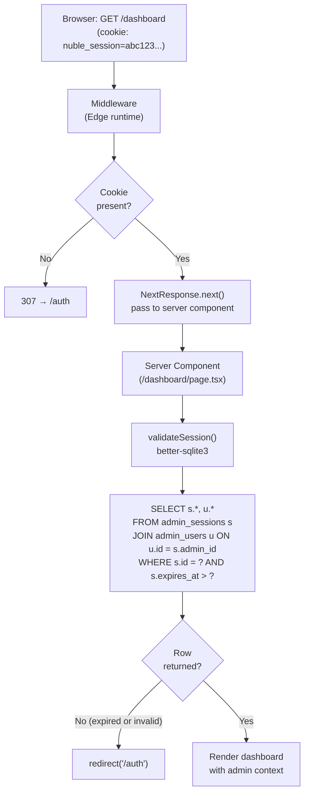

**Why two layers?**

The Edge runtime (middleware) cannot load native binaries — `better-sqlite3` compiles to a `.node` file that only runs in Node.js. So middleware can only check cookie *presence*. The full validity check (expiry, DB lookup, user still exists) happens inside the server component where the full Node.js runtime is available. If a cookie exists but the session has expired or been revoked, the server component catches it and redirects.

---

## Phase 9 — Two-Layer Observability

Once running, the console monitors the service layer through two independent channels so it always has an accurate picture regardless of service health.

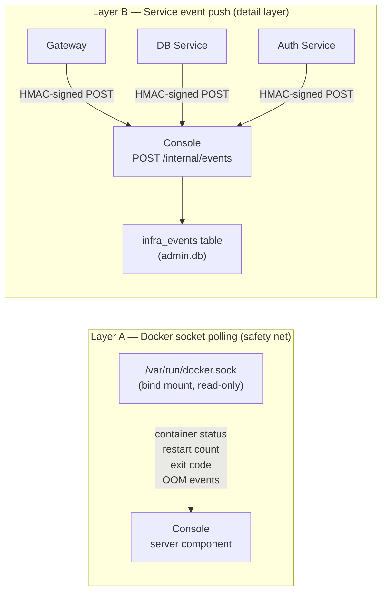

### Layer A — Docker socket

The console container mounts `/var/run/docker.sock` read-only. Server components call the Docker API directly:

```
GET /containers/json
GET /containers/{id}/json
GET /containers/{id}/logs?tail=100&follow=true
```

This works even when every service is crashed — the Docker daemon is always running on the host and always knows the container state.

### Layer B — Service event push

When services are healthy, they fire-and-forget structured events:

```
POST http://console/internal/events
X-Nuble-Sig: <HMAC-SHA256 of payload using INTERNAL_HMAC_SECRET>

{
  "source": "db",
  "event_type": "migration.ran",
  "payload": { "version": "0003", "duration_ms": 42 }
}
```

The console verifies the HMAC before writing to `infra_events`. Unsigned requests are silently dropped. Services never retry — if the console is unreachable, the event is lost (that is acceptable; Layer A covers the gap).

---

## Full Timeline — Zero to Console

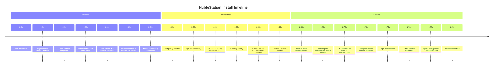

---

## What Can Go Wrong and How It Recovers

| Failure point | Symptom | Recovery |
|---|---|---|
| Docker not installed | install.sh exits at step 1 | Script auto-installs via apt/dnf/pacman |
| GitHub download fails | Bundle missing | Retry 3× with backoff |
| admin.db seed fails | Blank DB | Drop and recreate (idempotent) |
| docker compose fails | Containers not starting | `compose down` + retry once; print logs on second failure |
| Container unhealthy after boot | Health check timeout | Print specific container logs + docs link |
| Console can't open admin.db | 500 on every request | Check bind mount path in docker-compose.yml |
| CoreDNS not reached by devices | `*.clinic.local` doesn't resolve | Router DNS must point to host IP — shown in success banner |
| Session expired | Redirect to /auth | Re-login; sessions last 7 days |
| Service crashes after install | Dashboard shows "Down" badge | Layer A (Docker socket) detects it; Layer B events stop |
