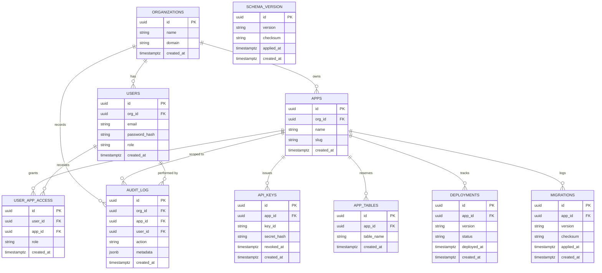

# Platform Schema — Entity Relationship Diagram

The `platform` PostgreSQL schema holds all NubleStation infrastructure tables. These are shared across tenants and managed exclusively by the platform layer — app developers never access them directly.

Ten tables are defined under `pgSchema("platform")` in `apps/db/src/db/schema/platform.ts` and migrated via drizzle-kit on service boot (see ADR 003 §11).

## Key Design Notes

- **`api_keys.key_id`** — plaintext indexed column used for O(1) lookup; `secret_hash` is Argon2id. API key format: `nbl_<key_id>.<secret>` (ADR 003 §4).
- **`app_tables.table_name`** — org-wide unique reservation. Prevents two apps in the same org from claiming the same `tenant_data.*` table name (ADR 003 §4).
- **`schema_version`** — platform self-migration tracking. One row per applied Drizzle migration, with SHA-256 checksum of the SQL file (ADR 003 §11).
- **`audit_log`** — append-only. No UPDATE/DELETE policies; written by platform middleware, not app code.
- **No `tenant_data` tables here** — app-defined tables live in the `tenant_data` schema with RLS + `FORCE ROW LEVEL SECURITY`. They are created dynamically by the migration runner (Phase 3) and in tests by `helpers/tenant-data.ts`.
- **RLS is OFF on all `platform.*` tables** — access is controlled at the application layer (HMAC-verified gateway → DB service middleware).
