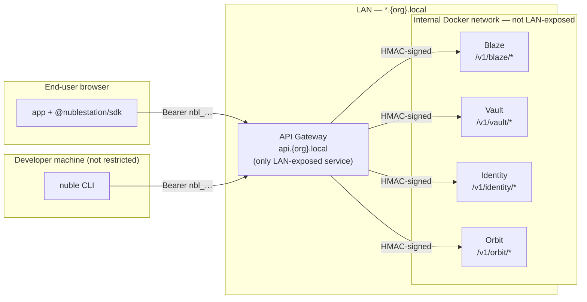
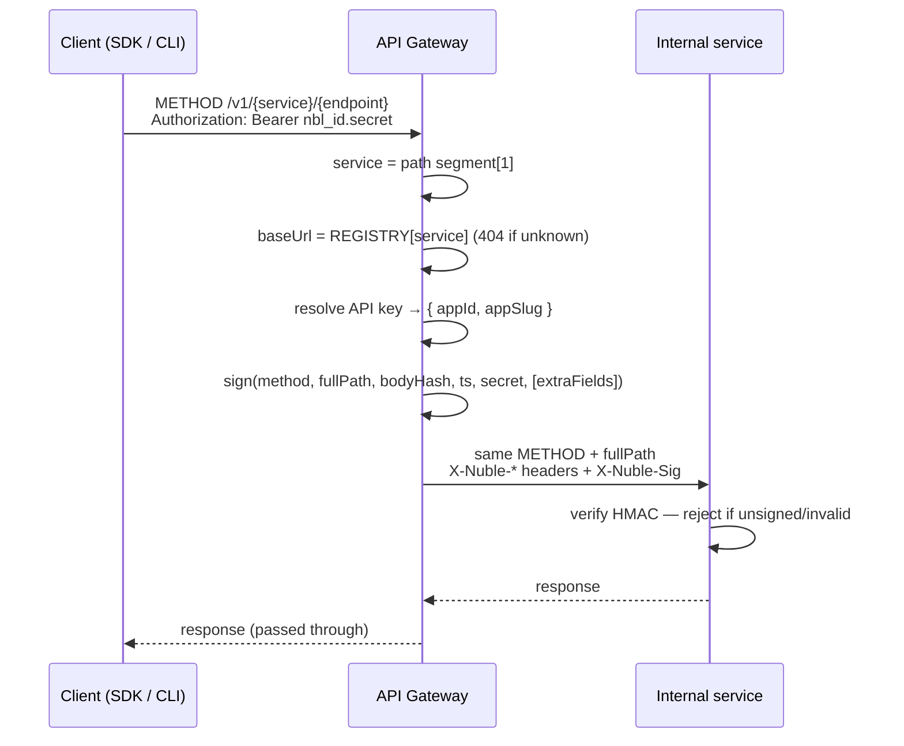
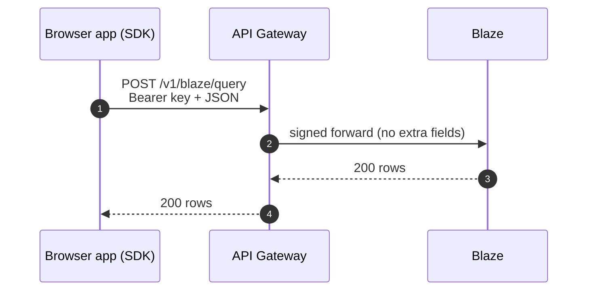
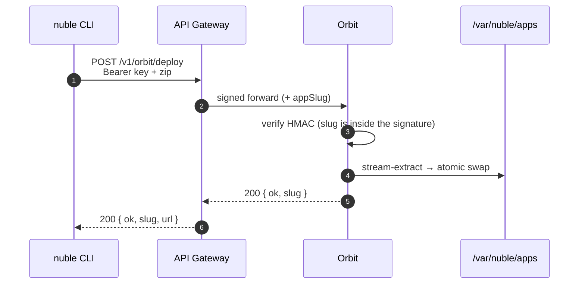

# NubleStation — Plug-and-play service contract

> **Scope:** Every service that runs behind the API Gateway — Blaze, Identity, Vault, Orbit, and any future v2 service — must satisfy this contract in full. No exceptions, no partial implementations.

Decision record: ADR 009. Cryptographic detail of the signing handshake: [`hmac-signing-flow.md`](./hmac-signing-flow.md).

This document has two halves:

1. **The routing contract** — the single request shape (`/v1/{service}/{endpoint}`) and how the Gateway dispatches it. This is what makes the platform plug-and-play.
2. **The security contract** — the three invariants every service must enforce so that routing can be trusted.

---

## Core principles

1. **One door.** Every developer- and end-user-facing request enters through the **API Gateway** (`api.{org}.local`) — the only service published on the LAN. Internal services listen only on the Docker bridge network.
2. **One path shape.** Every routed request uses `/v1/{service}/{endpoint}`, where `{service}` is the service **codename** (`orbit`, `blaze`, `vault`, `identity`).
3. **Signed or rejected.** The Gateway signs each forwarded request with `INTERNAL_HMAC_SECRET`. Services never trust an unsigned request. The secret never leaves the Gateway.
4. **Two client types, same contract.** REST services (Blaze, Vault, Identity) are consumed from the browser via `@nublestation/sdk`. Orbit is consumed from the terminal via the `nuble` CLI. Same `Bearer nbl_…` credential, same gateway, different payload.
5. **Plug-and-play.** The Gateway dispatches purely on `{service}`, looked up in a registry mapping codename → internal URL. A v2 service is added by registering one entry.

---

# Part 1 — The routing contract

## Topology



The Gateway is the trust boundary: everything to its left presents an API key; everything to its right trusts only an HMAC signature.

## The path contract

| Method(s) | Canonical path | Routed to | Driven by |
|---|---|---|---|
| any | `/v1/blaze/{endpoint}` | Blaze (database) | SDK |
| any | `/v1/vault/{endpoint}` | Vault (storage) | SDK |
| any | `/v1/identity/{endpoint}` | Identity (auth) | SDK |
| `POST` | `/v1/orbit/deploy` | Orbit — receive zip, extract, atomic swap | CLI |
| `POST` | `/v1/orbit/rollback` | Orbit — swap `current/` ↔ `.previous/` | CLI |

**Health endpoints are the one exception.** `GET /healthz` and `GET /readyz` are **not** prefixed and **not** signed — they are probed directly by Caddy / Docker Compose on the internal network, never through the Gateway.

## How the Gateway dispatches a request



```text
1. match  /v1/:service/*
2. service = segment[1]              // "orbit" | "blaze" | "vault" | "identity"
3. baseUrl = REGISTRY[service]       // env-configured internal URL
4. if !baseUrl        → 404 unknown_service
5. resolve API key    → { appId, appSlug }   // 401 on any failure
6. sign(method, fullPath, sha256(body), timestamp, secret, extraFields?)
7. forward to (baseUrl + fullPath) with X-Nuble-* headers
```

The **full path is passed through unchanged** — the HMAC payload includes the path, so signer and verifier must see the exact same string. No rewriting, no stripping.

## The service registry — the plug-and-play seam

The Gateway holds one map from codename to internal URL. It is the only thing that knows which services exist.

| Codename | Path prefix | Internal URL (env var) | Client | Extra signed fields |
|---|---|---|---|---|
| Blaze | `/v1/blaze/*` | `BLAZE_INTERNAL_URL` | SDK | — |
| Vault | `/v1/vault/*` | `VAULT_INTERNAL_URL` | SDK | — |
| Identity | `/v1/identity/*` | `IDENTITY_INTERNAL_URL` | SDK | — |
| Orbit | `/v1/orbit/*` | `ORBIT_INTERNAL_URL` | CLI | `appSlug` |

**Extra signed fields** are an optional, lexicographically-sorted set of `key=value` lines appended to the HMAC payload (ADR 007 §8). Orbit needs the app slug to choose its filesystem directory, so the Gateway signs `appSlug` into the payload — Orbit trusts the slug *because it is inside the signature* and never queries the database to translate `app_id → slug`. Services that pass no extras keep a **byte-identical** payload to the original v1 format, so their signing logic is unchanged.

## SDK clients vs. the CLI client

| | SDK clients — Blaze / Vault / Identity | CLI client — Orbit |
|---|---|---|
| Runs in | End-user browser (shipped in the app bundle) | Developer terminal |
| Package | `@nublestation/sdk` | `@nublestation/cli` |
| Credential | `Bearer nbl_…` (injected into the bundle by `nuble deploy`) | `Bearer nbl_…` (from `~/.nuble/config`) |
| Typical payload | JSON (REST) | `multipart/form-data` zip upload |
| Purpose | Read/write app data at runtime | Ship the frontend itself |
| Signed extras | none | `appSlug` |





---

# Part 2 — The security contract (the three invariants)

## 1. No LAN exposure

Services are never reachable from the LAN. Only **Gateway** has host-mapped ports.

```yaml
# infra/docker-compose.yml
services:
  gateway:
    ports:
      - "80:3000"   # exposed on the LAN via Caddy

  blaze:            # no `ports:` — Docker-internal only
    expose:
      - "3001"

  identity:         # no `ports:` — Docker-internal only
    expose:
      - "3002"
```

`expose:` makes the port reachable only to other containers on the same Docker network. `ports:` maps to the host and therefore the LAN. A service that adds a `ports:` entry breaks this contract.

## 2. No unsigned request accepted

Every HTTP route except `/healthz` and `/readyz` must run the `hmacAuth` middleware before any handler logic executes. A request without a valid Gateway signature is rejected with `401` before it touches business logic.

```typescript
import { Hono } from "hono";
import { hmacAuth } from "./middleware/hmac.js";

const app = new Hono();

// Health probes — no auth required by orchestrators
app.get("/healthz", (c) => c.json({ ok: true }));
app.get("/readyz", (c) => c.json({ ok: true }));

// Everything else — HMAC required
app.use("/v1/*", hmacAuth);
app.route("/", myRoutes);
```

The middleware must be registered **before** any authenticated route. Registering it on only some routes is not acceptable.

## 3. Trusted context, not raw headers

After `hmacAuth` passes, the service has trusted values on the Hono context. Routes read these, never the raw headers.

| Variable | Type | Source |
|---|---|---|
| `c.var.appId` | `string` (UUID) | Extracted and verified by `hmacAuth` |
| `c.var.userId` | `string` (UUID) | Extracted and verified by `hmacAuth` |
| `c.var.appSlug` | `string` (kebab) | Orbit only — verified from the signed `appSlug` extra field |

```typescript
// CORRECT
app.post("/v1/orbit/deploy", (c) => {
  const slug = c.var.appSlug;   // safe — verified by hmacAuth
});

// WRONG — bypasses the trust boundary
app.post("/v1/orbit/deploy", (c) => {
  const slug = c.req.header("x-nuble-app-slug");  // never do this
});
```

---

## The HMAC middleware

Every service gets its own copy of the middleware file, but the logic is always imported from `@nublestation/shared` — never reimplemented locally.

```typescript
// apps/<service>/src/middleware/hmac.ts
import type { MiddlewareHandler } from "hono";
import { z } from "zod";
import {
  HMAC_MAX_SKEW_MS,
  X_NUBLE_APP_ID,
  X_NUBLE_SIG,
  X_NUBLE_TIMESTAMP,
  X_NUBLE_USER_ID,
  computeHmac,
  sha256Hex,
  verifyHmac,
} from "@nublestation/shared";
import { loadConfig } from "../config.js";
import type { HonoVariables } from "../types.js";

const uuidSchema = z.string().uuid();

export const hmacAuth: MiddlewareHandler<{ Variables: HonoVariables }> = async (c, next) => {
  const cfg = loadConfig();
  const appId     = c.req.header(X_NUBLE_APP_ID);
  const userId    = c.req.header(X_NUBLE_USER_ID);
  const timestamp = c.req.header(X_NUBLE_TIMESTAMP);
  const sig       = c.req.header(X_NUBLE_SIG);

  if (!appId || !userId || !timestamp || !sig) {
    return c.json({ ok: false, error: "missing_signature_headers" }, 401);
  }

  const ts = Number(timestamp);
  if (!Number.isFinite(ts) || Math.abs(Date.now() - ts) > HMAC_MAX_SKEW_MS) {
    return c.json({ ok: false, error: "stale_or_invalid_timestamp" }, 401);
  }

  if (!uuidSchema.safeParse(appId).success) {
    return c.json({ ok: false, error: "invalid_app_id" }, 400);
  }

  const bodyBytes = new Uint8Array(await c.req.raw.clone().arrayBuffer());
  const bodyHash  = sha256Hex(bodyBytes);
  const expected  = computeHmac(
    c.req.method,
    c.req.path,
    bodyHash,
    timestamp,
    cfg.INTERNAL_HMAC_SECRET,
  );

  if (!verifyHmac(expected, sig)) {
    return c.json({ ok: false, error: "bad_signature" }, 401);
  }

  c.set("appId", appId);
  c.set("userId", userId);
  await next();
};
```

The reference implementation lives in `apps/blaze/src/middleware/hmac.ts`. When scaffolding a new service, copy it. The only thing that changes is the import path of `loadConfig` and `HonoVariables`.

**Services that consume extra signed fields** (Orbit's `appSlug`) read the corresponding header, validate its format, and pass it as `extraFields` to `computeHmac` so the recomputed signature matches the Gateway's. They then expose it as `c.var.appSlug`.

## Signed headers reference

| Header | Value | Verified by middleware |
|---|---|---|
| `x-nuble-app-id` | UUID of the tenant (app) | UUID format + HMAC |
| `x-nuble-user-id` | UUID of the user or session | presence only in Phase 1 |
| `x-nuble-app-slug` | kebab-case app slug (Orbit only) | format + HMAC (signed extra field) |
| `x-nuble-timestamp` | Unix timestamp in ms (string) | skew ≤ 30 s |
| `x-nuble-sig` | HMAC-SHA256 hex of canonical payload | `timingSafeEqual` |

**Canonical payload signed by the Gateway:**

```
METHOD\nPATH\nBODY_SHA256_HEX\nTIMESTAMP_MS[\nKEY=VALUE...]
```

Without extra fields (Blaze / Vault / Identity) the payload ends at the timestamp — byte-identical to the v1 format. With extra fields (Orbit), sorted `KEY=VALUE` lines are appended, each on its own line:

```
POST
/v1/orbit/deploy
<body sha256 hex>
1716134400000
appSlug=tasks
```

All constants live in `packages/shared/src/headers.ts`. Do not hardcode header names in service code.

## Environment variable requirement

Every service must declare `INTERNAL_HMAC_SECRET` as a required variable. If it is absent at boot, the service must refuse to start:

```typescript
// apps/<service>/src/config.ts
import { z } from "zod";

const schema = z.object({
  INTERNAL_HMAC_SECRET: z.string().min(32),
  // ... other vars
});

export function loadConfig() {
  return schema.parse(process.env);
}
```

If the secret is missing, `schema.parse` throws at boot time, preventing a service from silently accepting requests with an undefined secret.

## Error response format

All middleware rejections use the same shape: `{ "ok": false, "error": "<code>" }`.

| Condition | Status | Error code |
|---|---|---|
| Any required header missing | 401 | `missing_signature_headers` |
| Timestamp skew > 30 s or non-numeric | 401 | `stale_or_invalid_timestamp` |
| `app-id` is not a valid UUID | 400 | `invalid_app_id` |
| HMAC does not match | 401 | `bad_signature` |

The generic messages are intentional — the caller cannot tell "wrong secret" from "tampered body" from "replayed request".

---

## New-service checklist

When scaffolding a new service:

- [ ] No `ports:` mapping in `docker-compose.yml` — `expose:` only
- [ ] `INTERNAL_HMAC_SECRET` required in config schema; service refuses to boot without it
- [ ] `/healthz` and `/readyz` registered **before** the `hmacAuth` middleware
- [ ] `hmacAuth` registered on `/v1/*` **before** any business routes
- [ ] Routes read `c.var.appId` / `c.var.userId` (and `c.var.appSlug` if applicable), never raw headers
- [ ] `hmac.ts` imports only from `@nublestation/shared`; no local HMAC reimplementation
- [ ] `HonoVariables` declares the trusted context fields
- [ ] **Registered in the Gateway service registry** (`{CODENAME}_INTERNAL_URL` + map entry)
- [ ] Routes mounted under the canonical `/v1/{codename}/*` prefix

## Adding a service in v2 (the payoff)

A new service — say a `Pulse` metrics service at `/v1/pulse/*` — is added in three steps, none touching the Gateway's core logic:

1. **Build the container** under `apps/pulse/`, reusing the standard `hmacAuth` middleware. It listens only on the internal network and exposes `/healthz` + `/readyz`.
2. **Register it** in the Gateway: add `PULSE_INTERNAL_URL` to config and one entry to the service registry map.
3. **Expose it to clients**: a `nuble.pulse.*` SDK module if it is developer-facing REST, or a `nuble` CLI subcommand if it is an ops tool. Add the Compose service definition.

No new authentication model, no Gateway rewrite, no per-service CORS. The contract absorbs the new service.

## What the Gateway does (for context)

Gateway is the only service that speaks to clients. It:

1. Parses `Authorization: Bearer nbl_<id>.<secret>` from the client.
2. Looks up the API key in `platform.api_keys` (Redis cache, then Postgres).
3. Verifies the Argon2id hash.
4. Resolves `app_id` (and `app_slug` for Orbit) from the key row.
5. Signs the forwarded request with `INTERNAL_HMAC_SECRET` and attaches the `x-nuble-*` headers.
6. Proxies to the correct internal service over the Docker bridge.

Services never see client API keys or session tokens — only Gateway-signed internal requests.

---

## Security properties

| Property | Mechanism |
|---|---|
| Only Gateway can reach services | Docker bridge network; no host-mapped ports on services |
| Gateway cannot be impersonated | `INTERNAL_HMAC_SECRET` — shared only between Gateway and services |
| Body tampering detected | SHA-256 of body is part of the signed payload |
| Tenant binding | `app_id` (and `appSlug` for Orbit) carried inside the signed payload |
| Replay attacks prevented | Timestamp skew window of ±30 seconds |
| Timing attacks prevented | `timingSafeEqual` for HMAC comparison; `argon2.verify` for the key check |
| Enumeration prevented | Gateway returns a single generic 401 for all auth failures |

---

## Current implementation status

This contract is the **target**. As of M5 (Orbit spine):

- **Canonical going forward:** `/v1/{codename}/{endpoint}` for every service.
- **Legacy exception:** Blaze is currently routed as `/v1/db/*`. It should be renamed to `/v1/blaze/*` to conform, migrating the gateway/Blaze code and the `signRequest` test together.
- **Orbit (this milestone):** `POST /v1/orbit/deploy`, `POST /v1/orbit/rollback`, plus unprefixed `/healthz` and `/readyz`. No database connection in M5 — the `platform.deployments` audit row is written in M8.

---

## References

- [`hmac-signing-flow.md`](./hmac-signing-flow.md) — the signing/verification handshake in detail
- ADR 001 — apps are rows, services are containers
- ADR 003 §14 — Gateway as sole LAN entry; signed internal headers
- ADR 007 — Orbit deployment service; §8 the `appSlug` signed field
- ADR 008 — CLI and SDK architecture; the two client types
- ADR 009 — this contract as a locked decision
