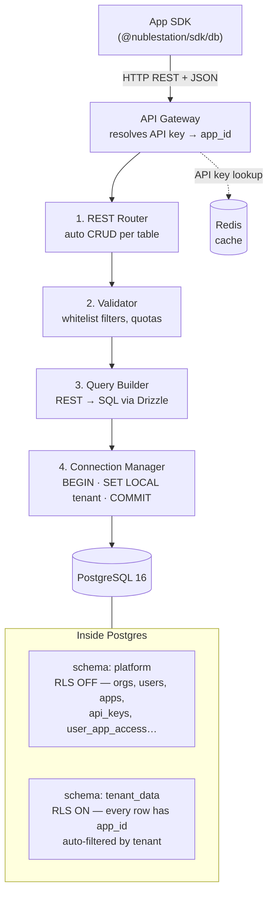
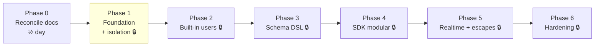
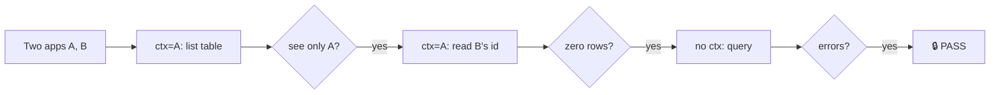

# Database Service — Roadmap

> The **one doc to follow**. Deep detail lives in `adr/003-database-service-architecture.md` — open it only when a phase says "see ADR §X".

---

## The mental model (look at this, not the prose)

**One sentence:** the SDK never speaks SQL — it sends REST, the server adds the
tenant filter at the database level (RLS), so one app physically cannot read
another app's rows.

---

## Phases at a glance

🔒 = a phase is **not done** until its tenant-isolation test passes. Phase 1's
isolation test is *the* milestone — if it's green, the product's core promise is real.

---

## Where to run things

| Environment | Machine | Postgres | Use for |
|---|---|---|---|
| **Dev** | MacBook (pg installed) ✅ | native local | daily coding: schema, RLS, migrations, isolation tests |
| **Staging** | Ubuntu VM + Docker | Compose Postgres + PgBouncer | parity check, **the only place to validate pooling (⚠1)** |
| **Prod** | clinic mini-PC | Compose Postgres | delivery (`main` branch) |

Dev = `dev` branch on the Mac. Move to `staging` when infra+services run on the VM. `main` = delivered & verified in staging.

---

## The 7 concerns (what could bite, and when we handle it)

| # | Concern (plain words) | Worst case | Handled in |
|---|---|---|---|
| 1 | Reused DB connections could carry one app's "who am I" into the next request | Cross-clinic data leak | P1 (build right) + **Staging** (validate PgBouncer) |
| 2 | Shared `users`/`files` views can bypass the security filter by default | App sees others' data | P2 |
| 3 | A query with no tenant set — error, or silently empty? | Hidden wrong results | P1 (decide: **error / fail-closed**) |
| 4 | `CLAUDE.md` still says "Drizzle or Prisma", no Redis — contradicts ADR 003 | Re-deciding settled things | P0 |
| 5 | SQL-safety parser is native C — may not build in Alpine image | Phase-3 emergency | P1 (2-min smoke test) |
| 6 | The schema DSL has no home package yet | Tangled DSL code | P3 (`packages/schema`) |
| 7 | One fat SDK = bloated apps (your todo-list concern) | 2 MB todo app | P4 (ADR 004 *before* SDK code) |

Detail on any of these → ADR 003 (§5 for 1–3, §15 for 4–5, §6 for 6, and the SDK packaging note for 7).

---

## Phase 0 — Reconcile docs · ½ day · do first

- [x] ⚠4 `CLAUDE.md`: ORM = **Drizzle**; API framework = **Hono**; added **Redis**; DNS = "CoreDNS only"
- [x] ⚠3 ADR 003 §5: added "Missing Tenant Context: Fail Closed (Decided)"

**Gate:** ✅ no doc contradicts another.

---

## Phase 1 — Foundation 🔒 · Days 1–3

> Goal: prove one app can *never* see another's data.

**Decisions locked (no more debate):**
- Framework = **Hono** (lighter, fits LAN ethos; matches ADR §15 lean toward it)
- Missing tenant context = **error / fail-closed** (⚠3, intentional)
- Dev DB = **native Postgres on the Mac** (no Docker locally)

### 1a — The Spine · START HERE NOW · ~1 day

> Smallest thing that *could* leak data, then prove it can't. No HTTP, no SDK, no Redis, no full schema yet — just a script + a test.

- [ ] `apps/api` scaffolded (Hono, TypeScript) + Drizzle + `pg`
- [ ] **Minimal** migration: `platform.apps` (just `id`, `name`) + one tenant table `tenant_data.notes` (`id`, `app_id`, `body`) with its RLS policy
- [ ] ⚠1 Connection Manager: `BEGIN → SET LOCAL app.current_tenant → query → COMMIT`, prepared statements **off**
- [ ] 🔒 **Isolation test green** (the diagram above) — run via a plain script/Vitest against local pg

**Gate:** isolation test passes locally. **This is the milestone.** Once green, the architecture is proven and momentum starts.

### 1b — Complete the foundation · after spine is green

- [ ] Remaining `platform` tables: `organizations`, `users`, `api_keys`, `user_app_access`, `deployments`, `migrations`, `audit_log`
- [ ] Postgres + Redis services in `infra/docker-compose.yml` (for staging parity)
- [ ] ⚠5 Smoke test: `pg-query-parser` installs in `node:20-alpine`
- [ ] 🔒 Re-run isolation test in CI (Dockerized parity)

---

## Phase 2 — Built-in `users` 🔒 · Days 4–6

- [ ] `platform.users` CRUD (platform-only API)
- [ ] `tenant_data.users` **view**, filtered by `user_app_access`
- [ ] ⚠2 Pick view security: `security_invoker = true` **or** baked-in filter — same choice for all built-in views
- [ ] SDK: `nuble.users.findBy()`, `.create()`, …
- [ ] 🔒 Isolation test: App A can't see App B's users **through the view**

---

## Phase 3 — Schema DSL 🔒 · Days 7–10

- [ ] ⚠6 Scaffold `packages/schema`
- [ ] DSL parser (Zod) → validated structure
- [ ] Generator: DSL → SQL, auto-inject `app_id`, auto-RLS policy
- [ ] Migration runner = **callable library** (CLI / dashboard / future deploy all reuse it)
- [ ] Migration safety: `pg-query-parser`, allow CREATE/ALTER/INDEX/VIEW only; checksum drift refused; per-app advisory lock
- [ ] REST router + validator + query builder
- [ ] 🔒 Isolation test: a developer-defined table works end-to-end and stays isolated

---

## Phase 4 — SDK "pay for what you use" 🔒 · Days 11–13

- [ ] ⚠7 **Write ADR 004 (SDK packaging) BEFORE any SDK code**: multi-entry (`/db`, `/auth`, `/storage`), tree-shakeable, types-only schema, opt-in all-in-one
- [ ] Type generation from DSL → local `.nuble/types.ts`
- [ ] Builder chain: `.where() .orderBy() .include() .limit()`
- [ ] 🔒 Bundle check: a `/db`-only todo app contains **no** auth/storage code (grep the bundle)
- [ ] Integration: demo "tasks" app compiles & runs

---

## Phase 5 — Realtime + escape hatches 🔒 · Days 14–16

- [ ] Auto triggers → `NOTIFY` on tenant table changes
- [ ] SSE endpoint + SDK `.subscribe()` (tenant + filter scoped)
- [ ] L1 computed fields → generated columns; L2 named queries (tenant filter required, logged)
- [ ] 🔒 Isolation test: a subscription never delivers another app's events

---

## Phase 6 — Hardening 🔒 · Days 17–20

- [ ] Per-request quotas + `statement_timeout`
- [ ] Audit logging for sensitive ops
- [ ] ⚠1 **Staging-only:** validate PgBouncer transaction pooling under load
- [ ] Backup: `pg_dump` (atomic) + filesystem snapshot
- [ ] 🔒 Re-run **all** isolation tests as a regression gate

---

## Parked — real, but NOT now (don't let these block execution)

These are valid and you correctly spotted them. They are deliberately out of
today's scope. Recorded here so they're not lost; each gets handled when its
trigger arrives — not before.

| Parked item | Why deferred | Revisit when |
|---|---|---|
| Secret management (API key storage, rotation, env injection) | DB service doesn't need it to prove isolation; it's a cross-cutting concern | Phase 1b (`api_keys` table) → real design when **Auth service** starts |
| Deployment service ↔ DB service env/secrets boundary | Deployment service isn't being built today; no contract to define yet | When the **Deployment service** ADR is written |
| Other services (Auth, Storage) consuming the DB | They consume `platform.*`; contracts only matter once those services exist | Each consumer's own ADR (DB just exposes the schema) |
| Schema-per-app vs row-level | **Already decided** — row-level + RLS (ADR §3). Not reopening. | — (closed) |
| `tenant_data.users/files` shared views (⚠2) | Depends on `platform.users` + Auth; not needed for the spine | Phase 2 |
| Redis API-key cache | Pure optimization; correctness works without it | Phase 1b / Phase 6 |

**Rule for parked items:** if one starts blocking a 🔒 test, it's no longer
parked — pull it into the current phase. Otherwise leave it alone.

---

## The only rule

**No phase is done until its 🔒 isolation test passes.** If isolation ever
regresses, stop everything and fix it before adding anything else.
